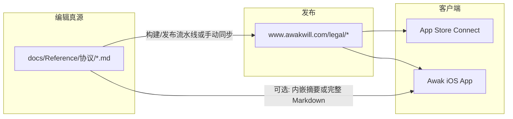
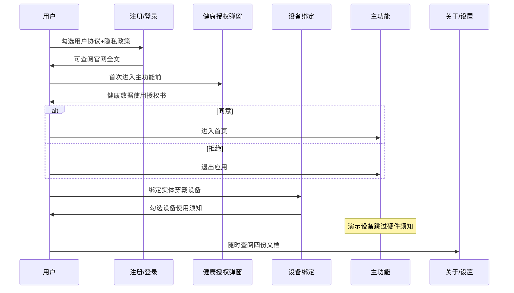

# 法律文档体系与产品对接说明

**版本**：v1.0  
**日期**：2026-06-18  
**状态**：设计稿 v1.1（**官网 LEGAL-01 已实施**；App 侧 LEGAL-02~08 待开发）  
**关联真源**：`docs/Reference/协议/*.md`

---

## 1. 文档目的

本文档说明 Awak 首版（iOS · 中国区 App Store）四份法律文本的**角色分工**、**官网挂载方案**、**与 App 的对接触点**、**版本同步流程**及 **App Store Connect 配置对照**，供后续开发、法务与提审使用。

---

## 2. 文档清单与角色

| 文档 | 仓库路径 | 官网建议 URL | 是否 App Store 必填 | 用户同意方式 |
|------|----------|--------------|---------------------|--------------|
| 用户服务协议 | `觉醒意志（杭州）健康科技有限公司用户协议.md` | `/legal/terms` | 建议提供（注册勾选关联） | 注册/登录勾选 + 可查阅全文 |
| 用户隐私政策 | `觉醒意志（杭州）健康科技有限公司用户隐私政策.md` | `/legal/privacy` | **必填**（Connect 隐私政策 URL） | 注册勾选 + 关于页入口 |
| 健康数据使用授权书 | `觉醒意志（杭州）健康科技有限公司健康数据使用授权书.md` | `/legal/health-data-consent` | 不单独填 URL，但审核可能抽查 | **单独弹窗**「同意并继续」 |
| 可穿戴设备使用须知 | `觉醒意志（杭州）健康科技有限公司可穿戴设备使用须知.md` | `/legal/device-safety` | 非必填 | 首次绑定真机前确认（建议） |

---

## 3. 是否必须挂载在官网？

**结论：是，且这是成熟商业 App 的标准做法。**

| 要求方 | 说明 |
|--------|------|
| **Apple App Store Connect** | 必须填写可公开访问的**隐私政策 URL**（HTTPS，无需登录）。推荐：`https://www.awakwill.com/legal/privacy` |
| **用户服务协议** | 不强制独立 URL，但审核与用户投诉处理时需提供可访问全文；放官网 `/legal/terms` 最稳妥 |
| **健康数据授权书 / 设备须知** | 无独立 URL 硬性要求；放官网便于客服发链接、应用内 WebView 打开、法务统一真源 |
| **国内合规实践** | 应用商店详情页、隐私合规检测常要求隐私政策、第三方清单可外链访问 |

**官网角色**：法律文本的**对外发布真源（Published Source）**；Git 仓库 `docs/Reference/协议/` 为**编辑真源（Authoring Source）**。



---

## 4. 推荐官网 URL 结构

基址：[https://www.awakwill.com/](https://www.awakwill.com/)

| 路径 | 页面标题 | 备注 |
|------|----------|------|
| `/legal` | 法律信息索引 | 列出四份文档链接、更新日期、客服邮箱 |
| `/legal/terms` | 用户服务协议 | |
| `/legal/privacy` | 隐私政策 | **填入 App Store Connect** |
| `/legal/health-data-consent` | 健康数据使用授权书 | |
| `/legal/device-safety` | 可穿戴设备使用须知 | |
| `/legal/personal-info-collection` | （可选）个人信息收集清单 | 可从隐私政策附录 A 拆页 |
| `/legal/third-party-sharing` | （可选）第三方信息共享清单 | 可从隐私政策附录 B 拆页 |

页脚全局链接建议至少包含：**隐私政策**、**用户协议**、**联系我们**（support@awakwill.com）。

---

## 5. 与现有 App 的对接设计（待开发）

### 5.1 当前 App 状态（截至 2026-06-18）

| 模块 | 文件 | 现状 | 差距 |
|------|------|------|------|
| 内嵌法律正文 | `apps/mobile/lib/settings/legal_document_content.dart` | 短版用户协议 + 隐私政策 | 与新版四份文档不一致 |
| 法律页 | `apps/mobile/lib/settings/legal_page.dart` | 支持内嵌 + 外链 `AWAK_LEGAL_*_URL` | 外链默认空；仅 terms/privacy 两种 |
| 关于页 | `apps/mobile/lib/settings/about_page.dart` | 用户协议、隐私政策入口 | 官网仍为 `awak.health`，需改为 `awakwill.com` |
| 注册勾选 | `auth_legal_consent_row.dart` / 登录页 | 勾选用户协议 + 隐私政策 | 部分入口仍为 placeholder |
| 健康授权弹窗 | — | **未实现** | 需新建 |
| 设备绑定须知 | — | **未实现** | 需新建 |
| 友盟初始化 | `analytics_facade.dart` | 隐私同意后初始化 | 与隐私政策表述一致 ✓ |
| 联系我们 | `help_page.dart`（待改名为联系流程） | 「我的 → 联系我们」→ `mailto:support@awakwill.com` | 与协议一致；完整帮助中心后续版本再做 |

### 5.2 推荐对接策略（商业化一般做法）

**双轨但单一真源**：

1. **对外/审核**：官网 HTTPS 全文（必做）  
2. **应用内**：  
   - **注册/登录**：勾选「已阅读并同意《用户服务协议》和《隐私政策》」→ 链到 `LegalPage` 或应用内 WebView 打开官网  
   - **关于页**：用户协议、隐私政策、可穿戴设备使用须知（可选）、官网链接  
   - **联系我们**：「我的 → 联系我们」→ 唤起邮件至 support@awakwill.com（与协议一致）  
   - **健康数据授权**：首次进入主 Tab 前弹窗（未同意则限制健康功能）  
   - **设备绑定**：首次绑定**实体** Awak 智能穿戴设备前，勾选「已阅读《可穿戴设备使用须知》」  

**内嵌 vs 外链**：

| 方案 | 优点 | 缺点 | 建议 |
|------|------|------|------|
| A. 纯外链 WebView | 法务改一次官网即可，无发版 | 离线不可读；WebView 体验 | 隐私/协议全文 |
| B. 纯内嵌 Markdown | 离线可读 | 每次改协议需发版 | 不推荐作唯一真源 |
| C. **外链为主 + 内嵌摘要** | 审核友好、体验兼顾 | 需维护两处 | **推荐** |

**构建参数（已有）**：

```bash
--dart-define=AWAK_LEGAL_TERMS_URL=https://www.awakwill.com/legal/terms
--dart-define=AWAK_LEGAL_PRIVACY_URL=https://www.awakwill.com/legal/privacy
```

建议扩展（待实现）：

```bash
--dart-define=AWAK_LEGAL_HEALTH_CONSENT_URL=https://www.awakwill.com/legal/health-data-consent
--dart-define=AWAK_LEGAL_DEVICE_SAFETY_URL=https://www.awakwill.com/legal/device-safety
```

### 5.3 触点流程图



### 5.4 待开发任务卡（建议拆分）

| ID | 任务 | 优先级 | 说明 |
|----|------|--------|------|
| LEGAL-01 | 官网 `/legal/*` 静态页发布 | P0 | 阻塞 App Store 隐私 URL |
| LEGAL-02 | 同步 `legal_document_content.dart` 摘要或改为 WebView | P0 | 与 v1.0 协议一致 |
| LEGAL-03 | 注册/登录法律链接接真页（去掉 placeholder） | P0 | |
| LEGAL-04 | `HealthDataConsentDialog` + 服务端同意记录 API | P0 | PIPL 单独同意 |
| LEGAL-05 | 真机绑定前「使用须知」勾选 | P1 | 演示设备 `demo_sim` 豁免 |
| LEGAL-06 | 关于页官网链接 `awakwill.com` | P1 | |
| LEGAL-07 | 「健康数据授权管理」设置页 | P2 | 撤回授权、关闭算法改进 |
| LEGAL-08 | 协议变更应用内弹窗 + 版本号比对 | P2 | 重大变更时再同意 |

### 5.5 服务端（如需）

| 接口 | 用途 |
|------|------|
| `POST /v1/app/legal/consents` | 记录用户同意的文档类型、版本号、时间戳 |
| `GET /v1/app/legal/consents` | 查询是否需重新同意 |
| 文档版本枚举 | `terms: 1.0`, `privacy: 1.0`, `health_data: 1.0` |

首版可仅本地 `SharedPreferences` 记录 + 后续补云端审计；但 **健康数据单独同意** 建议尽快落库以备检查。

---

## 6. App Store Connect 配置对照

### 6.1 必填项

| 字段 | 填写建议 |
|------|----------|
| Privacy Policy URL | `https://www.awakwill.com/legal/privacy` |
| App 名称 | 与协议中「Awak」一致或说明商号关系 |

### 6.2 App Privacy（营养标签）与隐私政策一致性

在 Connect 中声明的数据类型须与《隐私政策》一致，首版建议勾选/声明包括但不限于：

| 数据类型 | 关联目的 | 是否关联用户 |
|----------|----------|--------------|
| 健康与健身 | 核心功能 | 是 |
| 联系信息（手机号） | 账号 | 是 |
| 用户内容（营养图片、反馈） | 功能/客服 | 是 |
| 标识符（设备 ID） | 友盟统计 | 是（同意后） |
| 诊断（崩溃） | 稳定性 | 可脱钩 |

**勿声明 HealthKit**（首版未接入）。

### 6.4 算法与 AI 相关披露（审核友好）

| 场景 | 建议 |
|------|------|
| 隐私政策正文 | 强调 **Awak 自研算法/模型** 承担核心分析；AI 用于**个性化建议与说明**，§2.2 列明提交/不提交的数据范围 |
| App Privacy 营养标签 | 勾选「健康与健身」及实际采集项；若 Connect 询问是否将数据用于「第三方 AI」，按**实际委托境内 AI 推理且会提交健康指标摘要**如实勾选 |
| 审核备注 | 可写：「核心评分由 Awak 自有算法完成；个性化建议由境内合规 AI 基于授权健康指标与身体基础信息生成，不传手机号/姓名/账号 ID，不出境」 |
| 对外品牌 | 统一使用「Awak 健康模型 / 专有算法」；**禁止**对外宣称「不向 AI 发送任何敏感/健康数据」——与事实不符 |
| 禁用表述 | 勿写「不会透露任何敏感信息」；应写「不向 AI 服务提供可直接识别身份的信息」 |

**内部合规**：实际调用的 AI 技术服务链路（含模型供应方）建议在法务/internal 备案文档中单独维护，供监管抽查；与用户可见协议分离。

### 6.5 审核备注（Review Notes）建议

- 提供测试账号与密码  
- 说明「虚拟演示设备」入口：首页未绑定区域 2 秒内连点 5 次 → 确认 → 模拟数据 Banner  
- 明确：**非医疗器械**；ECG 为参考用途  
- 算法说明：核心评分与趋势由 **Awak 自有算法/模型** 完成；个性化建议由境内合规 AI 基于授权的健康指标、Awak 分析摘要及身体基础信息（性别/身高体重等）生成，**不向 AI 传输手机号、姓名、账号 ID**，不出境  
- **当前提审版本配套实体硬件形态**（如智能戒指）可在审核备注中说明，无需写进对外协议正文  
- 隐私政策 URL 可正常访问  

---

## 7. 版本与同步流程

```
1. 法务/产品在 docs/Reference/协议/*.md 修改
2. 更新文首「版本」「更新日期」
3. PR 评审（产品 + 法务 + 移动端）
4. 合并后发布到 www.awakwill.com/legal/*
5. 若仅为措辞澄清且非重大变更 → 可不强制用户重新同意
6. 若涉及收集范围扩大、共享第三方变更 → 应用内弹窗 + 必要时重新勾选
7. （可选）CI 从 md 生成静态 HTML，避免双份手写
```

**重大变更示例**：新增 HealthKit、新增境外传输、新增订阅扣费、新增向保险公司共享数据。

---

## 8. 首版已锁定业务事实（修订依据）

### 8.0 对外文案与内部用语

| 场景 | 用语 |
|------|------|
| **四份对外协议**（用户/审核可见） | **不使用「首版」**；用「当前」「本应用当前」或「截至本政策/协议更新之日」描述可变能力；对长期承诺（如不出境）直接陈述事实 |
| **本文档**（内部研发/法务） | 可保留「首版」「提审」「Phase」等里程碑用语 |

协议文首统一为：`版本 v1.0` + `更新日期` + `适用范围`（重大修订时递增版本号并更新日期）。

### 8.1 对外法律文本称谓约定

| 称谓 | 用途 |
|------|------|
| **Awak 智能穿戴设备** / **本设备** | 四份对外协议正文主称（覆盖戒指、手环及后续品类） |
| **Awak** / **本应用** | 软件侧 |
| 具体 SKU（如某型号戒指） | 仅出现在产品包装说明书、官网产品页、**App Store 审核备注**，不写进协议正文 |

### 8.2 业务事实表

以下事实已写入四份协议 v1.0，后续产品变更须同步修订：

| 项 | 首版决策 |
|----|----------|
| 上架范围 | iOS 中国区 |
| HealthKit | 不做 |
| 硬件 | Awak 智能穿戴设备（协议正文不限定戒指/手环等形态） |
| IAP 订阅 | 不做（协议保留未来增值服务表述） |
| 客服邮箱 | support@awakwill.com |
| 官网 | https://www.awakwill.com/ |
| 注销 | 7 日冷静期，期满硬删除用户数据 |
| 审计日志 | 脱敏保留 3 年 |
| 智能技术 | 核心：Awak 自研算法/模型；辅助：境内 AI 推理（提交健康指标+分析摘要+身体基础信息，**不含身份标识字段**），不出境 |
| 第三方（对外协议） | 具名：阿里云（ECS/OSS/短信/境内 AI 推理算力）、友盟+；**不对外具名具体 LLM 商标** |
| 第三方（内部合规备案） | 工程与法务另册维护实际 AI 技术服务链路，供监管抽查 |
| 演示模式 | 模拟数据，须 UI + 协议双重声明 |

---

## 9. 后续扩展（非首版）

| 场景 | 文档动作 |
|------|----------|
| 上架其他国家/地区 | 隐私政策英文版；跨境传输章节；可能需 DPA |
| 接入 HealthKit | 隐私政策 + 单独系统授权；Connect 标签更新 |
| 上线 IAP 订阅 | 用户协议恢复订阅专章；App Store 订阅披露 |
| 新增 SDK（推送、客服 IM） | 附录 B 第三方清单 + 版本号 |
| 新增硬件型号 | 设备须知区分型号或通用化（不出现代工/供应商名称） |

---

## 10. 本期交付物与未交付物

### 本期已完成（文本）

- [x] 四份协议 v1.0 修订（`docs/Reference/协议/`）
- [x] 本对接说明文档

### 本期刻意不做（按需求）

- [ ] App 代码改动（`legal_document_content.dart`、弹窗、绑定勾选等）
- [x] 官网 `/legal/*` 页面上线（见 §12）
- [ ] 服务端同意记录 API

---

## 11. 联系与责任

- 协议内容疑问：support@awakwill.com  
- 工程技术对接：移动端 Settings/Auth 模块 + 官网静态站维护方  
- 提审前检查清单：见 §6 + ADR-006 演示模式验收项  

---

## 12. 官网实现与 App 对齐事项（2026-06-18 实施）

### 12.1 内容真源与目录（官网路径）

| 类型 | 路径 | 说明 |
|------|------|------|
| 编辑真源（中文） | `content/legal/zh/*.md` | 法务修改首选位置 |
| 英文译本 | `content/legal/en/*.md` | 工程翻译稿；法务审校后直接改此目录 |
| 版本元数据 | `content/legal/meta.json` | slug、version、updatedAt；供 App 版本比对 |
| 共享 UI | `shared/features/legal/` | 法律页组件（PC 站 `src/` 与 Mobile 站 `mobile/` 共用） |
| 对接说明 | `docs/LEGAL-INTEGRATION-DESIGN.md` | 本文档 |

**slug 与文件映射**：

| slug | 中文文件 | 页面标题 i18n key |
|------|----------|-------------------|
| `terms` | `terms.md` | `legal.documents.terms` |
| `privacy` | `privacy.md` | `legal.documents.privacy` |
| `health-data-consent` | `health-data-consent.md` | `legal.documents.healthDataConsent` |
| `device-safety` | `device-safety.md` | `legal.documents.deviceSafety` |

### 12.2 官网 URL 规范

基址：`https://www.awakwill.com`

| 场景 | URL 示例 |
|------|----------|
| 法律索引（中文） | `/zh/legal` |
| 隐私政策（中文，**App Store Connect 推荐**） | `/zh/legal/privacy` |
| 用户协议（中文） | `/zh/legal/terms` |
| 健康数据授权（中文） | `/zh/legal/health-data-consent` |
| 设备使用须知（中文） | `/zh/legal/device-safety` |
| 英文对应页 | `/en/legal/{slug}` |
| 裸路径兼容 | `/legal/privacy` → 自动重定向至 `/zh/legal/privacy` |
| 手机站（UA 跳转 /m/） | `/m/zh/legal/{slug}` |
| App 内嵌 WebView（推荐） | `/{locale}/legal/{slug}?embed=1` |

`?embed=1` 行为：隐藏营销 Navbar 与页脚，仅保留文档标题、正文、语言切换，适合 App 内打开。

### 12.3 法务修改与发布流程

1. 修改 `content/legal/zh/*.md`（必要时同步 `en/*.md`）
2. 更新文首「版本」「更新日期」，并同步 `content/legal/meta.json`
3. 本地预览：`npm run dev`（PC `:3003`）或 `npm run dev --prefix mobile`（`:3004`）
4. 发布：`npm run build:site && npm run deploy`
5. 重大变更时递增 version，并触发 App 侧 LEGAL-08 重新同意流程

### 12.4 App 端对齐清单（待开发）

| ID | 事项 | 说明 |
|----|------|------|
| LEGAL-01 | 官网 `/legal/*` | **已完成** |
| LEGAL-02 | 内嵌摘要或 WebView | 建议 WebView 打开官网全文；URL 按用户语言拼接 |
| LEGAL-03 | 注册/登录法律链接 | 指向 `/{locale}/legal/terms` 与 `/{locale}/legal/privacy` |
| LEGAL-04 | 健康数据授权弹窗 | 同意后可链至 `/{locale}/legal/health-data-consent?embed=1` |
| LEGAL-05 | 真机绑定前设备须知 | 链至 `/{locale}/legal/device-safety?embed=1` |
| LEGAL-06 | 关于页域名 | `awak.health` → `awakwill.com` |

**URL 拼接（Dart 伪代码）**：

```dart
String legalUrl(String slug, {bool embed = true}) {
  final locale = Localizations.localeOf(context).languageCode; // zh | en
  final base = const String.fromEnvironment(
    'AWAK_LEGAL_BASE_URL',
    defaultValue: 'https://www.awakwill.com',
  );
  final q = embed ? '?embed=1' : '';
  return '$base/$locale/legal/$slug$q';
}
```

**构建参数建议**：

```bash
--dart-define=AWAK_LEGAL_BASE_URL=https://www.awakwill.com
```

不再为每份文档单独写死完整 URL；运行时按 `locale` + `slug` 拼接。

**slug 枚举**：`terms` | `privacy` | `health-data-consent` | `device-safety`

### 12.5 App Store Connect

| 字段 | 填写值 |
|------|--------|
| Privacy Policy URL | `https://www.awakwill.com/zh/legal/privacy` |

提审前确认该 URL 可公开访问（HTTPS、无需登录、返回中文隐私政策正文）。

### 12.6 官网入口

- 全站页脚：隐私政策、用户协议
- 页脚「支持」组：法律信息 → `/legal` 索引
- 注册页：用户协议、隐私政策分链
- 服务生态页隐私弹窗：「查看完整隐私政策」

---

*本文档随协议版本迭代；当 App 完成对接后，应更新 §5.1「当前 App 状态」表格并关闭对应 LEGAL-* 任务。*
